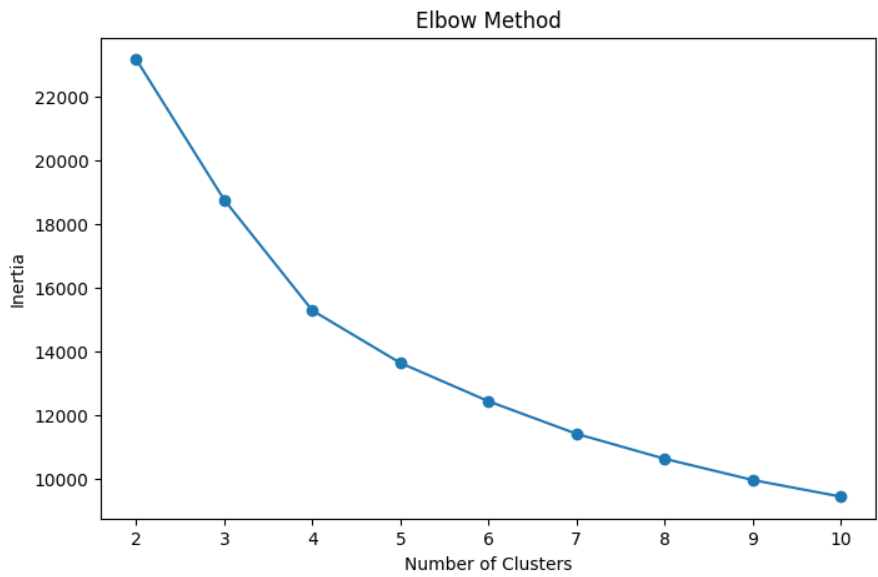
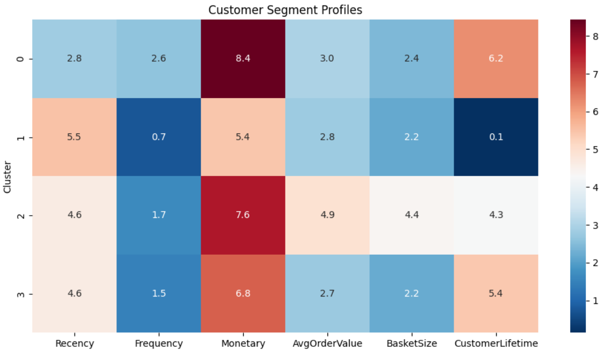
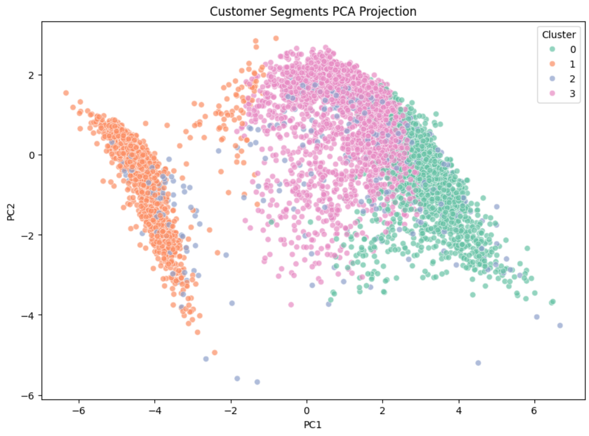
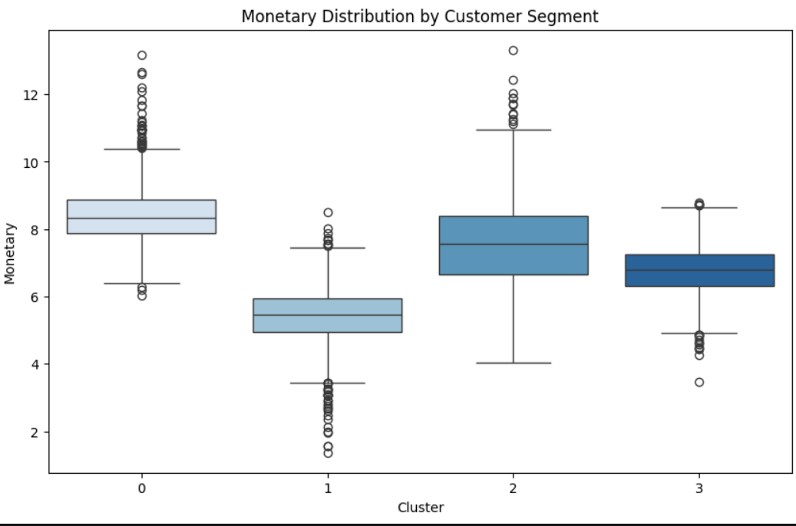

# Retail Customer Segmentation using Unsupervised Machine Learning

## Project Overview

This project applies unsupervised machine learning techniques to segment retail customers based on purchasing behavior using transactional e-commerce data.

The objective is to identify meaningful customer groups that can support data-driven marketing strategies, improve customer retention, and optimize business decision-making.

The project explores multiple clustering approaches, evaluates model performance, and delivers actionable business insights through customer segmentation.

---

# Business Problem

Understanding customer purchasing behavior is essential for:

* Customer retention
* Personalized marketing
* Revenue optimization
* Loyalty program design
* Customer lifetime value improvement

This project aims to identify hidden customer segments using unsupervised learning techniques.

---

# Dataset

The dataset contains transactional records from a UK-based online retail company between 2009 and 2011.

Features include:

* Invoice information
* Product details
* Purchase quantities
* Transaction dates
* Customer identifiers
* Country information

After preprocessing and feature engineering, customer-level behavioral metrics were created using RFM analysis.

---

# Methodology

## Data Cleaning

* Removed missing customer IDs
* Filtered cancelled transactions
* Removed invalid quantities and prices

## Feature Engineering

Created customer-level features including:

* Recency
* Frequency
* Monetary Value
* Average Order Value
* Basket Size
* Customer Lifetime

## Data Transformation

* Logarithmic transformation
* Standardization using StandardScaler

## Dimensionality Reduction

* Principal Component Analysis (PCA)

## Clustering Models

The following clustering algorithms were evaluated:

* KMeans
* Agglomerative Clustering
* Gaussian Mixture Models

---

# Model Evaluation

Models were compared using:

* Silhouette Score
* Calinski-Harabasz Index
* Davies-Bouldin Index

KMeans with 4 clusters was selected as the final model due to its balance between interpretability, cluster separation, and business applicability.

---

# Final Customer Segments

| Cluster   | Description                  |
| --------- | ---------------------------- |
| Cluster 0 | VIP Loyal Customers          |
| Cluster 1 | One-Time / Churned Customers |
| Cluster 2 | High-Value Bulk Buyers       |
| Cluster 3 | Regular Customers            |

---

# Key Insights

* Four distinct customer segments were successfully identified.
* A small group of VIP customers generates disproportionately high revenue.
* A large percentage of customers exhibit low engagement and high churn risk.
* Customer purchasing behavior varies significantly across segments.
* Customer segmentation enables more targeted business strategies.

---

# Visualizations

## Elbow Method



---

## Customer Segment Heatmap



---

## PCA Cluster Visualization



---

## Monetary Distribution by Segment



---

# Tech Stack

* Python
* Pandas
* NumPy
* Scikit-learn
* Matplotlib
* Seaborn
* Joblib
* Jupyter Notebook

---

# Repository Structure

```bash
retail-customer-segmentation-ml/
│
├── data/
│   ├── raw/
│   └── processed/
│
├── notebooks/
│   ├── 01_data_cleaning_and_eda.ipynb
│   ├── 02_feature_engineering.ipynb
│   ├── 03_clustering_models.ipynb
│   └── 04_business_report.ipynb
│
├── models/
│   ├── kmeans_customer_segmentation.pkl
│   └── scaler.pkl
│
├── images/
│
├── README.md
├── requirements.txt
└── .gitignore
```

---

# How to Run

```bash
git clone https://github.com/yourusername/retail-customer-segmentation-ml.git
```

Install dependencies:

```bash
pip install -r requirements.txt
```

Run notebooks in order:

1. Data Cleaning & EDA
2. Feature Engineering
3. Clustering Models
4. Business Report

---

# Future Improvements

Potential future enhancements include:

* Cluster stability analysis
* Bootstrap validation
* DBSCAN implementation
* UMAP dimensionality reduction
* Real-time customer segmentation pipeline
* Integration with dashboards and BI tools

---

# Business Value

This project demonstrates how machine learning can transform raw transactional data into actionable business intelligence.

The final segmentation strategy can support:

* Personalized marketing campaigns
* Customer retention initiatives
* Revenue optimization
* Loyalty strategies
* Customer lifetime value analysis

---

# Author

Geronimo Fernandez

Aspiring Data Analyst / Data Scientist focused on machine learning, analytics, and business intelligence.
